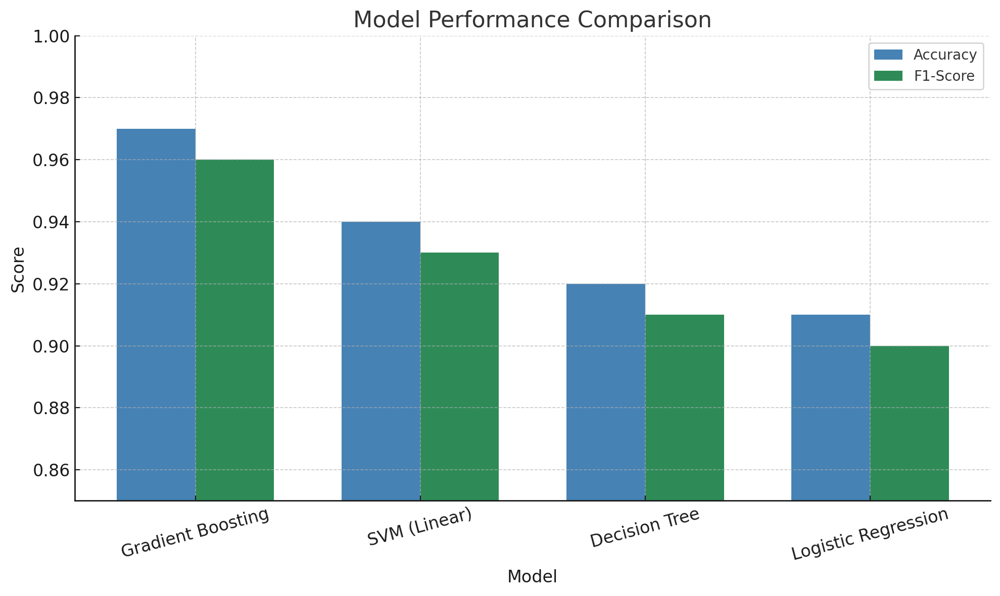

# 🔐 SQL Injection Detection Using Machine Learning

Welcome to my final year project! This repository presents a machine learning-based system for detecting SQL injection (SQLi) attacks — one of the most prevalent threats in web application security. This work combines my interests in cybersecurity and machine learning, demonstrating my technical strengths across data preprocessing, model tuning, and secure software engineering.

## 📌 Project Overview

SQL injection remains one of the most common vulnerabilities in modern web systems. Traditional rule-based filters often fail to detect adversarial or obfuscated queries. In this project, I implemented a data-driven approach to automatically detect malicious SQL statements using machine learning classification models.

**Key Features:**

- Preprocessing of a large, labelled SQLi dataset (100,000+ queries)
- Text vectorization using **TF-IDF**
- Trained and tuned **multiple classifiers**:  
  - Gradient Boosting (best performer)  
  - Support Vector Machines  
  - Decision Trees  
  - Logistic Regression (L1 regularized)
- Evaluation using **cross-validation**, **F1-score**, and **accuracy**
- Detection of **adversarial queries** unseen in training
- Fully implemented in **Python** using **Scikit-learn**, `pandas`, and `matplotlib`

---

## 🛠️ Technologies Used

| Category           | Tools & Frameworks                  |
|--------------------|-------------------------------------|
| Language           | Python                              |
| Libraries          | Scikit-learn, Pandas, NumPy         |
| Visualisation      | Matplotlib, Seaborn                 |
| Text Processing    | TF-IDF (via `TfidfVectorizer`)      |
| Version Control    | Git & GitHub                        |

---

## 🎓 Skills Demonstrated

✅ Machine Learning: end-to-end model development and tuning  
✅ Data Science: vectorization, feature engineering, evaluation  
✅ Software Engineering: modular Python design and repo structure  
✅ Cybersecurity: applied understanding of SQLi attack vectors  
✅ Communication: presenting complex technical findings clearly  

---

## 📊 Model Performance

| Model                | Accuracy | F1-Score |
|----------------------|----------|----------|
| Gradient Boosting    | **0.97** | **0.96** |
| SVM (Linear)         | 0.94     | 0.93     |
| Decision Tree        | 0.92     | 0.91     |
| Logistic Regression  | 0.91     | 0.90     |

> 📈 *Gradient Boosting outperformed all other models and demonstrated robust generalisation on adversarial queries.*

---
